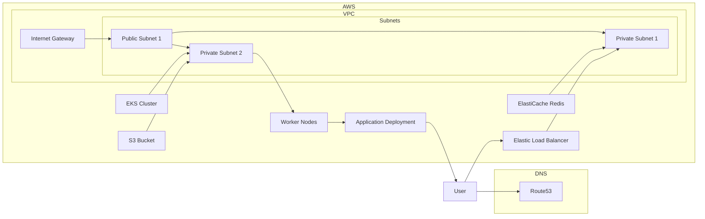

# Terraform Infrastructure Deployment

This repository contains Terraform scripts to deploy and manage your infrastructure on AWS using Terraform. The scripts provision various resources such as VPC, security groups, load balancer, EKS cluster, Redis, S3 bucket, and autoscaling. These resources are set up with default configurations, and you can customize them as needed.

## Infrastructure Diagram

The following diagram illustrates the infrastructure components created by this Terraform configuration:



This diagram provides a visual representation of the infrastructure components, including the VPC, subnets, internet gateway, Elastic Load Balancer, EKS cluster, worker nodes, application deployment, ElastiCache Redis, S3 bucket, and DNS (Route53).

## Prerequisites

Before getting started, ensure that you have the following:

- Terraform installed locally.
- AWS account credentials with appropriate permissions to create and manage resources.
- Basic knowledge of Terraform and AWS services.

## Workflow

The deployment workflow is automated using GitHub Actions. The Terraform deployment will be triggered when you push changes to the `main` branch or manually trigger the workflow using the GitHub Actions UI.

To view the workflow configuration, please refer to the [terraform-deploy.yml](.github/workflows/terraform-deploy.yml) file.

## Getting Started

Follow the steps below to deploy the infrastructure:

1. Clone this repository to your local machine.
2. Navigate to the `terraform/` directory.
3. Customize the variables in the `variables.tf` file according to your requirements. Update values such as domain name, instance types, and other parameters.
4. Commit and push the changes to the `main` branch.
5. The deployment workflow will be triggered automatically, and you can monitor the progress in the GitHub Actions tab.
6. Once the deployment is complete, Terraform will output important information such as the VPC ID, ALB DNS name, EKS cluster name, Redis endpoint, and S3 bucket name.
7. You can now start using your provisioned infrastructure for your application.

## Clean Up

To clean up and destroy the resources created by Terraform, run the following command:

```shell
terraform destroy
```

Note: This will permanently delete all resources managed by Terraform. Exercise caution when using this command.

## Contributing

Contributions are welcome! If you find any issues or have suggestions for improvements, please open an issue or submit a pull request.

## License

This project is licensed under the MIT License.
